# Interview Coder


A comprehensive interview preparation platform for mastering DSA, Low-Level Design, System Design, and Behavioral interviews.

## Problem

Technical interview preparation is fragmented across multiple tools: LeetCode for coding, Excalidraw for diagrams, ChatGPT for hints, and Anki for spaced repetition. Switching between tools breaks flow and makes it hard to track progress holistically.

Interview Coder consolidates everything into a single platform with integrated code execution, diagram drawing, AI assistance, and spaced repetition review.

## Features

- **Interactive Code Editor** - Write and run TypeScript code with Monaco Editor (VS Code engine)
- **Visual Design Tool** - Draw system architecture diagrams with Excalidraw integration
- **Multi-Provider AI Hints** - Get Socratic guidance without spoilers from OpenAI, Anthropic, Google Gemini, DeepSeek, or local CLI tools
- **Spaced Repetition System** - Review concepts using Anki-style flashcards with SM-2 algorithm
- **LeetCode Import** - Fetch problems directly via LeetCode API
- **Progress Tracking** - Monitor completion rates across DSA, LLD, HLD, and Behavioral categories
- **Pattern-Based Learning** - Group problems by algorithmic patterns (sliding window, two pointers, etc.)

## Architecture

```mermaid
graph TB
    subgraph "Frontend - React 19 + Vite"
        A[React Router] --> B[Pages]
        B --> C[Dashboard]
        B --> D[ProblemView]
        B --> E[AnkiReview]
        B --> F[ImportProblem]

        D --> G[Monaco Editor]
        D --> H[Excalidraw]
        D --> I[AI Chat]

        J[Hooks Layer] --> K[useAI]
        J --> L[useCodeExecution]
        J --> M[useSpacedRepetition]
        J --> N[useProgress]

        O[Contexts] --> P[AuthContext]
        O --> Q[CategoryContext]
    end

    subgraph "Local Dev Server - Express"
        R[CLI Bridge API] --> S[claude CLI]
        R --> T[codex CLI]
        R --> U[gemini CLI]
    end

    subgraph "Backend - Supabase"
        V[PostgreSQL] --> W[problems]
        V --> X[progress]
        V --> Y[notes]
        V --> Z[spaced_repetition]
        AA[Auth] --> AB[Email/Password]
    end

    subgraph "External APIs"
        AC[LeetCode API] --> AD[Problem Import]
        AE[OpenAI API]
        AF[Anthropic API]
        AG[Google Gemini API]
    end

    K --> R
    K --> AE
    K --> AF
    K --> AG

    L --> V
    M --> V
    N --> V
    P --> AA

    F --> AC

    style R fill:#f9f,stroke:#333,stroke-width:2px
    style V fill:#bbf,stroke:#333,stroke-width:2px
    style G fill:#bfb,stroke:#333,stroke-width:2px
    style H fill:#bfb,stroke:#333,stroke-width:2px
```



**Key Components:**

- **Frontend**: React 19 SPA with TailwindCSS, Monaco Editor for code, Excalidraw for diagrams
- **Local Dev Server**: Express proxy for CLI tools (claude, codex, gemini) to avoid API keys during development
- **Database**: Supabase PostgreSQL stores problems, user progress, notes, and spaced repetition schedules
- **External Integrations**: LeetCode API for problem import, multiple AI providers for hints

## Run Steps

### Prerequisites

- Node.js 18+
- Supabase account (free tier)

### Setup

1. **Clone and install**
   ```bash
   git clone https://github.com/yourusername/interview-coder.git
   cd interview-coder
   npm install
   ```

2. **Configure environment**
   ```bash
   cp .env.example .env.local
   ```

   Edit `.env.local`:
   ```bash
   VITE_SUPABASE_URL=your_supabase_project_url
   VITE_SUPABASE_ANON_KEY=your_supabase_anon_key
   ```

3. **Run database migrations**
   ```bash
   npx supabase db push
   ```

4. **Start development server**
   ```bash
   npm run dev
   ```

   Opens at `http://localhost:5173` (frontend) and `http://localhost:3456` (CLI bridge)

### Production Build

```bash
npm run build
npm run preview
```

Deploy to Vercel by importing the GitHub repository and setting environment variables.

---

**Tech Stack**: React 19, TypeScript, TailwindCSS, Vite, Supabase, Vercel
**License**: MIT